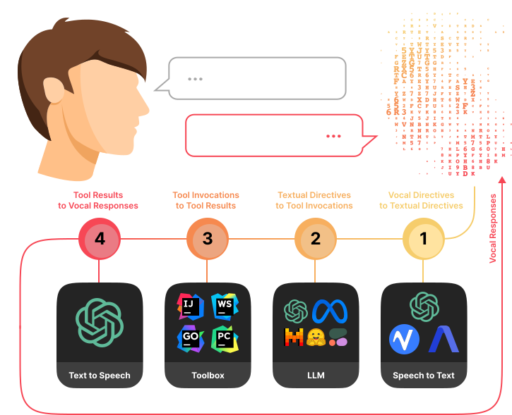

## Introduction

<!-- Plugin description -->

The Voqal Assistant is a programming assistant built for software developers looking to enhance their productivity with
natural language programming. Using Voqal, you can navigate, write, run, and debug software in JetBrains IDEs using both
oral and written speech. You can write code faster by voice coding with Voqal, reduce repetitive strain injuries, and
improve your focus and productivity. By typing with Voqal, you can quickly translate plain English into accurate code
snippets, saving you time and effort. Voqal is [fully configurable](https://docs.voqal.dev/prompting/overview)
and [privacy-focused](https://docs.voqal.dev/privacy), allowing you to customize your experience and control your
data. Voqal collects no personal data, audio recordings, or source code.
For more information, see the [documentation](https://docs.voqal.dev).

<!-- Plugin description end -->

## Overview

  

## Natural Oral Programming

<video src="https://github.com/voqal/voqal/assets/3278877/2783f724-5b51-46a8-b804-ec46f1dd374c" width="500">
</video>

## Natural Written Programming

<video src="https://github.com/voqal/voqal/assets/3278877/1752758a-e63d-4710-bdd9-36e0200ce65d" width="500">
</video>
