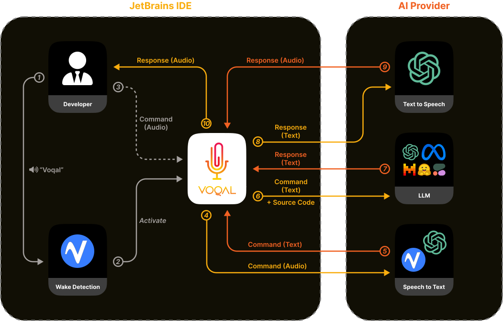

## Introduction

<!-- Plugin description -->

Voqal (pronounced vocal) is a vocal programming assistant.
Voqal allows you to program in IntelliJ with OpenAI's GPT4 using only your voice.
Using Voqal, you can simply ask for code to be explained or modified using natural spoken language.
No more copy/pasting to ChatGPT!

<!-- Plugin description end -->

## Overview

## Demonstration

<video src="https://github.com/voqal/voqal/assets/150201955/43b6dc68-e691-400c-81f2-0fb28c90fceb" width="400">

## Configuration

To use Voqal you need valid [Picovoice](https://picovoice.ai) & [OpenAI](https://openai.com) keys.

[template]: https://github.com/JetBrains/intellij-platform-plugin-template

[docs:plugin-description]: https://plugins.jetbrains.com/docs/intellij/plugin-user-experience.html#plugin-description-and-presentation
